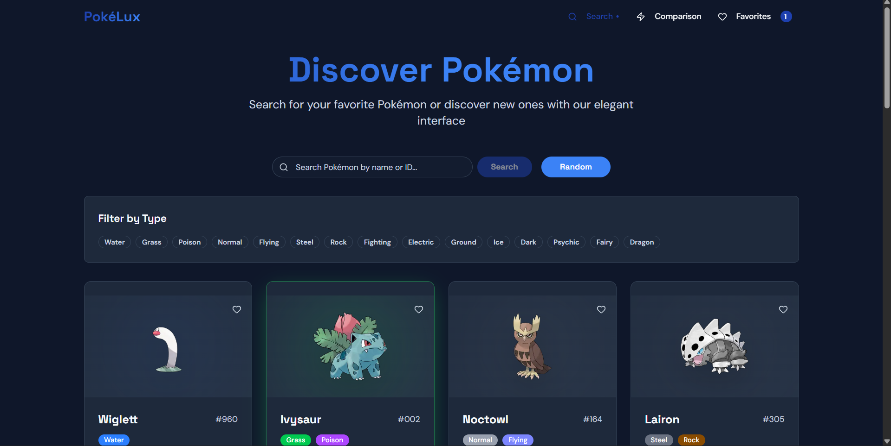

<div align="center">


<h1 align="center">
  
  <span style="margin-left: 8px;">Pokelux</span>
</h1>

<p>
A modern and elegant Pokédex built with Next.js — fast, animated, and powered by the PokéAPI 🔥
</p>

<div style="margin: 1rem 0;">
  
  
  
  
  
  
  
</div>

</div>

## 🌌 The Pokelux Experience

**Pokelux** is a sleek, animated, and modern Pokédex designed to explore Pokémon in a fast and immersive way.

The project focuses on:

- ⚡ Performance-first rendering
- 🎨 Clean & reusable UI components
- 🧠 Predictable global state
- ✨ Smooth and meaningful animations

Pokelux is both a **Pokémon fan project** and a **frontend showcase**.

## 🧩 Core Features

| Feature                      | Description                             | Tech         |
| ---------------------------- | --------------------------------------- | ------------ |
| **Pokémon Explorer** 🔍      | Browse Pokémon with pagination & search | PokéAPI      |
| **Detailed Pokémon View** 📖 | Stats, types, abilities & sprites       | Next.js      |
| **Favorites System** ⭐      | Save favorite Pokémon globally          | Zustand      |
| **Smooth Animations** ✨     | Page transitions & UI motion            | GSAP         |
| **Modern UI Components** 🎨  | Accessible & composable UI              | shadcn/ui    |
| **Responsive Design** 📱     | Optimized for all screens               | Tailwind CSS |

## 🖼️ App Preview

<div align="center">



</div>

## 🚀 Getting Started

```bash
# 1. Clone the repository
git clone https://github.com/HIRATRA/pokelux.git

# 2. Install dependencies
npm install

# 3. Run the development server
npm run dev
```

Open 👉 http://localhost:3000
